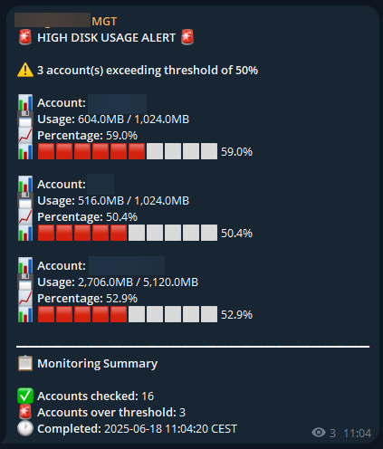

# Disk Usage Monitor for WHM Resellers with Telegram Notifications

This PHP script monitors the disk usage of cPanel accounts under a WHM reseller, sending consolidated alerts via Telegram when accounts exceed a specified threshold.

## Features

- **Reseller-Specific Monitoring**: Only checks accounts owned by the specified reseller.
- **Telegram Notifications**: Sends well-formatted, consolidated alerts to a Telegram chat or channel.
- **Configurable Threshold**: Set a custom disk usage percentage to trigger alerts.
- **Robust API Handling**: Gracefully handles various WHM API response formats and errors.
- **Detailed Logging**: Logs all actions and errors to a file for easy debugging.
- **CLI Interface**: Easy to run from the command line or a cron job.
- **Test Modes**: Includes options to test both WHM API and Telegram connections.

## Requirements

- PHP 7.4 or higher
- cURL extension for PHP
- WHM reseller account with API access
- A Telegram bot and chat/channel ID

## Setup

1.  **Clone the repository or download the script:**

    ```bash
    git clone https://github.com/your-username/whm-disk-monitor.git
    cd whm-disk-monitor
    ```

2.  **Configure the script (`disk_usage_monitor.php`):**

    Open `disk_usage_monitor.php` and fill in your details in the `Config` class:
    
    -   **`WHM_HOST`**: Your server's hostname.
    -   **`WHM_USER`**: Your WHM reseller username.
    -   **`WHM_API_TOKEN`**: Your WHM API token. You can generate one in *WHM -> Development -> Manage API Tokens*. The token needs `account-summary` and `list-accts` permissions. For security, it's recommended to whitelist the IP address that will be running the script.
    -   **`TELEGRAM_BOT_TOKEN`**: Your Telegram bot token from @BotFather.
    -   **`TELEGRAM_CHAT_ID`**: The ID of the chat or channel where you want to receive alerts. You can get this from @userinfobot.
    -   **`DEFAULT_THRESHOLD`**: The disk usage percentage that triggers an alert.
    -   **`TIMEZONE`**: The timezone for timestamps. A list of supported timezones can be found [here](https://www.php.net/manual/en/timezones.php).

## Usage

The script is designed to be run from the command line or via a cron job.

### Running a Manual Check

To run a manual check with the settings from your `Config` class:

```bash
php disk_usage_monitor.php
```

### Command-Line Options

-   `--test-telegram`: Send a test message to your configured Telegram chat to verify the connection.

    ```bash
    php disk_usage_monitor.php --test-telegram
    ```

-   `--help` or `-h`: Display the help message.

### Setting up a Cron Job

To automate the monitoring, set up a cron job in your cPanel.

1.  Find the full path to your PHP executable. You can usually find this by running `which php` in an SSH session or by checking your cPanel's "Select PHP Version" page.
2.  Go to **cPanel -> Advanced -> Cron Jobs**.
3.  Add a new cron job with the following command, adjusting the paths as necessary:

    ```bash
    /usr/local/bin/php /home/your_cpanel_user/path/to/disk_usage_monitor.php
    ```

    **Example Cron Schedule (runs daily at 2:00 AM):**

    ```
    0 2 * * *
    ```

## Example Telegram Alert

  

## License

This project is licensed under the Creative Commons Attribution-NonCommercial-ShareAlike 4.0 International License. See the [LICENSE](LICENSE) file for details.